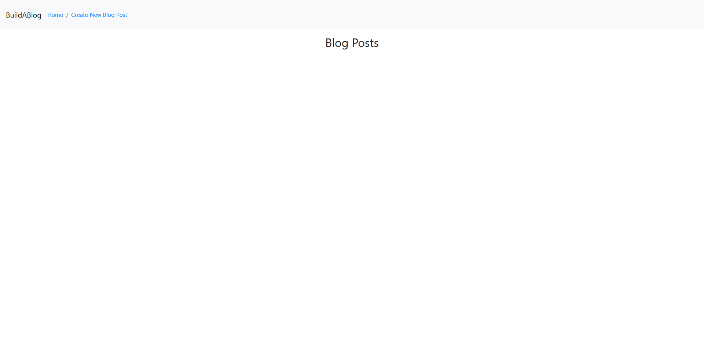
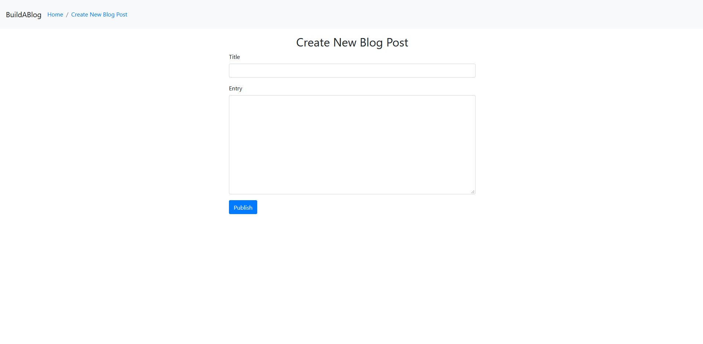
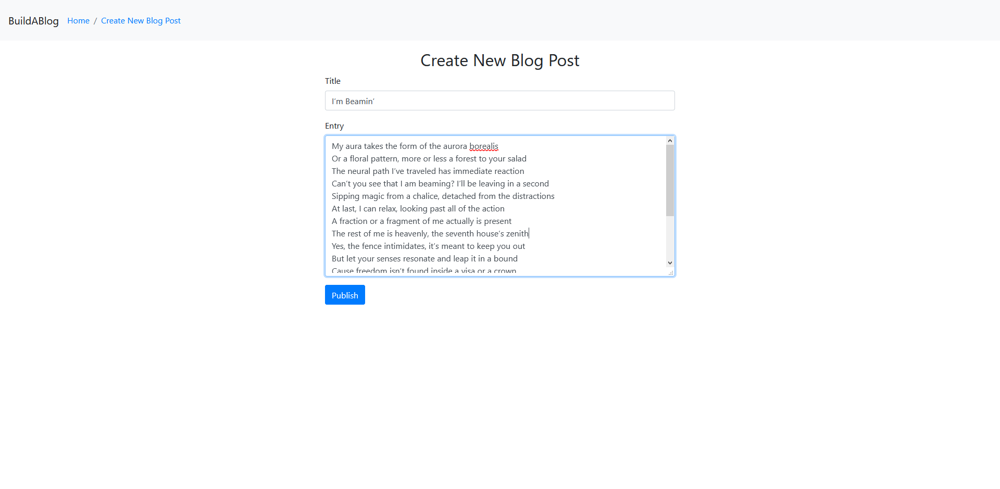
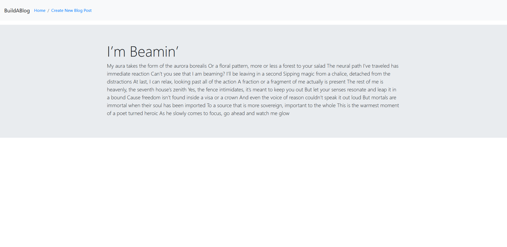
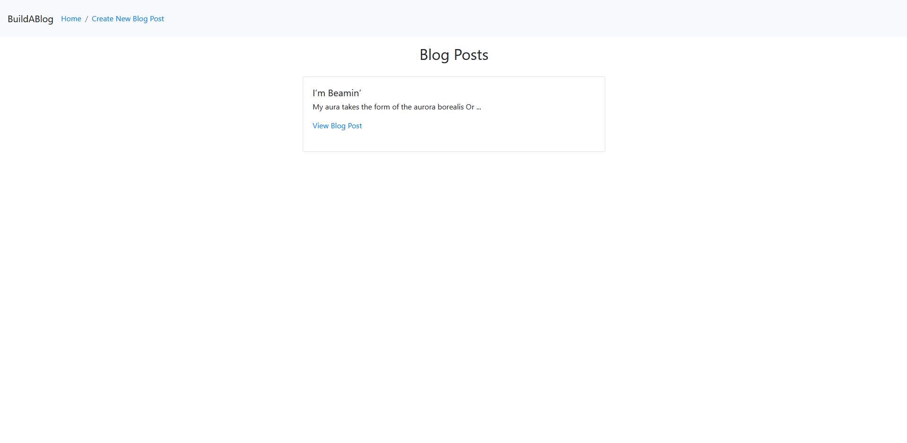
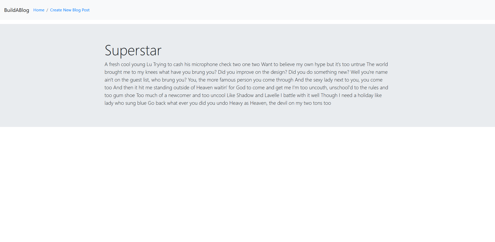
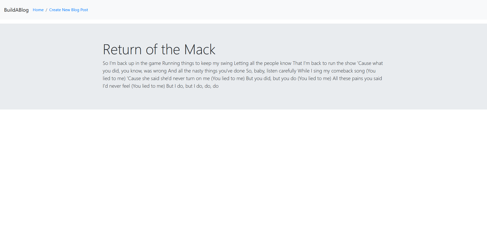
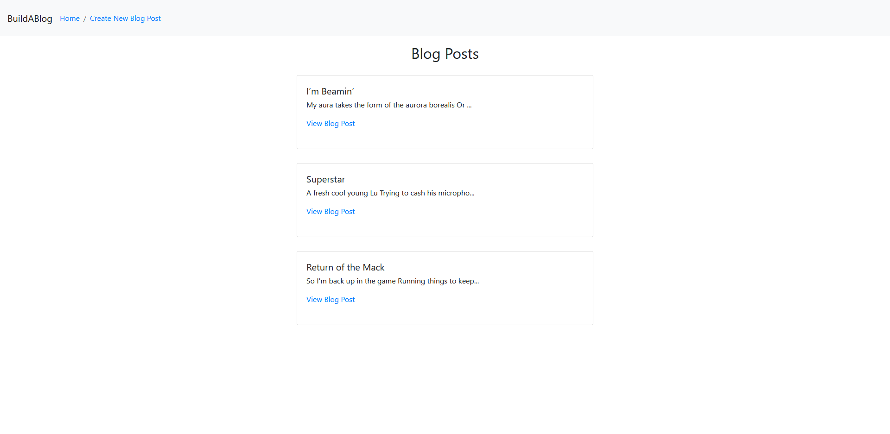

# Build A Blog
A Python-Flask web application where one user can build a blog. Updated to use Flask blueprints and Bootstrap. See below for a preview.

*This was initially a homework assignment for LaunchCode's Lc101 (2018)*

# Home Screen (before adding blog posts)

# Create New Blog Post Page

# Publishing a Blog Post (input)

# Publishing a Blog Post (output)

# Home Screen (after publishing one post)

# Publishing the lyrics to another one of my favorite songs

# Publishing more lyrics

# Home Screen (after adding multiple blog posts)

